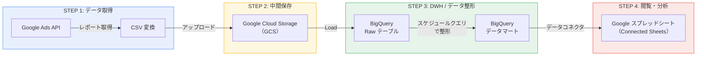

# データパイプライン構成提案書

## 概要

Google 広告のデータを BigQuery（DWH）に集約し、スプレッドシートで分析・閲覧できるデータパイプラインの構成提案です。

GCP のマネージドサービスと無料枠を活用することで、ほぼゼロコストでの運用が可能です。

---

## 提案構成

**実行基盤**: Cloud Functions + Cloud Scheduler（サーバーレス）、または既存サーバーで cron 実行

---

## 各ステップの解説

### STEP 1: Google Ads API からデータ取得

Google Ads API を呼び出してレポートデータを取得し、CSV ファイルとして GCS に保存します。

| 項目 | 内容 |
|------|------|
| **実行方法** | Cloud Functions + Cloud Scheduler、または既存サーバーで cron 実行 |
| **処理内容** | Google Ads API でレポート取得 → CSV に変換 → GCS にアップロード |
| **実行頻度** | 日次（早朝など業務開始前に実行） |
| **コスト** | Cloud Functions の無料枠内（月 200 万回呼び出し無料）で収まる想定 |

**ポイント**: API レスポンスを CSV に変換する際に、カラム名の整理やデータ型の統一などの前処理をこの段階で行えます。

### STEP 2: Cloud Storage → BigQuery にデータ転送

GCS に保存された CSV ファイルを BigQuery のテーブルにロードします。方法は以下の 2 つがあります。

#### 方式 A: LOAD DATA / bq load（スクリプト内で実行）

STEP 1 のスクリプトから続けて `LOAD DATA` 文または `bq load` コマンドを実行し、GCS の CSV を BigQuery にロードします。

| 項目 | 内容 |
|------|------|
| **実行方法** | STEP 1 のスクリプト内で `bq load` コマンドまたは BigQuery クライアントライブラリを実行 |
| **保存先** | BigQuery の Raw データ用テーブル（生データをそのまま保持） |
| **コスト** | 無料（BigQuery へのデータロードは課金対象外） |

| メリット | デメリット |
|----------|-----------|
| STEP 1 と同じスクリプト内で完結するため管理がシンプル | スクリプトにロード処理のコードを自分で書く必要がある |
| CSV 保存完了後に即ロードできるため、タイミングのズレが発生しない | ロードのリトライやエラー通知も自前で実装が必要 |
| 管理するサービスが増えない | — |

#### 方式 B: BigQuery Data Transfer Service（データ転送）

GCP コンソールから GCS → BigQuery の定期転送をスケジュール設定します。

| 項目 | 内容 |
|------|------|
| **実行方法** | BigQuery コンソール → 「データ転送」から GCS ソースの転送を作成・スケジュール設定 |
| **保存先** | BigQuery の Raw データ用テーブル（生データをそのまま保持） |
| **コスト** | 無料（Data Transfer Service 自体の利用料は無料） |

| メリット | デメリット |
|----------|-----------|
| スクリプトにロード処理を書かなくて済む | STEP 1 の CSV 保存完了とのタイミング調整が必要（スケジュールに時間差を設けるなど） |
| GCP コンソールから転送状況の確認やエラー通知の設定ができる | 管理するサービスが 1 つ増える |
| リトライ処理が自動で組み込まれている | 細かいロード条件（スキーマ変更時の挙動など）のカスタマイズに制約がある |

#### どちらを選ぶか

STEP 1 でスクリプトを書く前提であれば、**方式 A（LOAD DATA / bq load）** がシンプルです。CSV 保存 → ロードを 1 つのスクリプトで順番に実行できるため、タイミングの問題が発生しません。

一方、スクリプトの責務をデータ取得のみに限定し、ロード処理は GCP 側に任せたい場合は **方式 B（Data Transfer Service）** が適しています。

**補足**: いずれの方式でも、GCS 上の CSV はバックアップとしてそのまま残しておきます。BigQuery 側でテーブルを誤って変更・削除した場合でも、CSV から再ロードできます。

### STEP 3: スケジュールクエリでデータ整形（データマート作成）

BigQuery のスケジュールクエリ機能を使い、Raw データから分析しやすい形に整形してデータマート用テーブルを作成します。

| 項目 | 内容 |
|------|------|
| **実行方法** | BigQuery スケジュールクエリ（BigQuery コンソールから設定） |
| **処理内容** | 集計、結合、指標計算などの SQL を定期実行し、データマートテーブルを更新 |
| **実行頻度** | 日次（STEP 2 完了後に実行されるようスケジュール設定） |
| **コスト** | BigQuery 無料枠（月 1TB のクエリ処理）内で収まる想定 |

**ポイント**: SQL でデータ整形のロジックを管理するため、変更や追加が容易です。新しい分析軸が必要になった場合も SQL を追加するだけで対応できます。

### STEP 4: スプレッドシートとデータコネクタで接続

BigQuery のデータマートテーブルと Google スプレッドシートを Connected Sheets（データコネクタ）で接続し、スプレッドシート上でデータを閲覧・分析できるようにします。

| 項目 | 内容 |
|------|------|
| **接続方法** | Google スプレッドシートの「データ」→「データコネクタ」→「BigQuery」 |
| **前提条件** | Google Workspace Business Standard 以上の契約が必要 |
| **コスト** | 追加コストなし（Workspace 契約に含まれる） |

**ポイント**: Connected Sheets を使うと、BigQuery のデータをスプレッドシート上でピボットテーブルやグラフとして直接操作できます。データは BigQuery 側にあるため、スプレッドシートのセル数制限を気にする必要がありません。

---

## CSV 経由 vs BigQuery Data Transfer Service の比較

STEP 1〜2 については、Google が提供する BigQuery Data Transfer Service を使って Google Ads API → BigQuery を直接連携する方法もあります。以下に両方式の比較をまとめます。

### 比較表

| 観点 | CSV 経由（提案構成） | Data Transfer Service |
|------|---------------------|----------------------|
| **構成のシンプルさ** | スクリプト・ストレージ・スケジューラーの管理が必要 | Google コンソールから設定するだけで完結 |
| **開発コスト** | API 呼び出し〜CSV 変換のスクリプトを自作 | 不要（設定のみ） |
| **データのバックアップ** | GCS に CSV が残るため再ロード可能 | BigQuery に直接入るため別途バックアップが必要 |
| **前処理の柔軟性** | CSV 変換時にカラム加工・フィルタ・クレンジングが可能 | 取得データの加工はできない（BigQuery 側で後処理） |
| **デバッグのしやすさ** | CSV を目視確認して原因切り分けが容易 | BigQuery 上のデータから調査が必要 |
| **API 変更への追従** | 自分でスクリプトを修正する必要がある | Google が自動追従してくれる |
| **複数媒体への拡張** | Meta Ads、Yahoo 広告なども同じパターンで統一できる | Google 広告など対応媒体のみ。非対応媒体は別の仕組みが必要 |
| **ランニングコスト** | ほぼ無料（GCS・Cloud Functions の無料枠内） | 無料 |

### どちらを選ぶか

**Google 広告のみの運用**: Data Transfer Service が最もシンプルです。開発・保守の手間が最小限で済みます。

**複数の広告媒体を扱う予定がある場合**: CSV 経由の構成がおすすめです。すべての媒体を「API → CSV → GCS → BigQuery」という統一パターンで管理でき、パイプラインの設計に一貫性を持たせられます。

---

## まとめ

- GCP マネージドサービス中心の構成により、ほぼゼロコストでの運用が可能です
- 各ステップがシンプルで独立しているため、トラブルシューティングや変更が容易です
- 広告媒体やアカウントが増えた場合も、同じパターンを横展開するだけでスケール可能です